# Purpose

This document is a **documentation-only** record of every R script and analysis step used during the Bellabeat case study . 

> **WARNING — Documentation only**
This RMarkdown is for documentation/portfolio purposes and **must NOT** be executed as a single document. All code blocks are marked `eval = FALSE`. If you want to reproduce the analysis, copy each script block into standalone `.R` files and run them in the documented order.


# Goal
include every script we used , short purpose/inputs/outputs, and embed existing plot images. 

# Business objective 
Identify user activity patterns and actionable marketing segments from wearable data to inform targeted Bellabeat campaigns.

## Key numbers (quick facts)
- Filtered daily records (total_steps >= 1000): **n = 370** (rows).
- Matched sleep+activity records: **n = 39**.
- Steps ⇄ VeryActiveMinutes: **r ≈ 0.70 (p < 2.2e-16)**.
- Steps ⇄ Calories: **r ≈ 0.58 (p < 2.2e-16)**.
- Paired weekday vs weekend (per-user): **p ≈ 0.92** (no significant difference).
- Sleep vs steps (matched): **r ≈ -0.11 (p ≈ 0.49)** — no significant linear relation in the matched sample.
- User segments (k=3): counts: **Low = 14, Medium = 12, High = 4**.

## Limitations

**Summary:** The sleep–activity linkage is based on a small matched sample and heuristic cleaning steps, so statistical power and causal claims are limited. Treat findings as descriptive and exploratory.

- Small matched sample for sleep analyses (~39 rows) → low statistical power.  
- Non-wear filtering used a heuristic (`total_steps >= 1000`) and may misclassify borderline days.  
- Sleep aggregation used heuristics (counting `value == 1` and `sum(value)`) because minute-level flags were ambiguous.  
- Mixed-effects fits sometimes returned singular warnings or low ICC — interpret random effects cautiously.  
- Analyses are correlational; do **not** infer causality.


# Project structure 

- `data/` — contains `Cleaned_Bellabeat_Data_Final.xlsx`.
- `prepared/` — RDS objects created during preparation (e.g. `bellabeat_prepared_fixed.rds`).
- `outputs/` — CSV outputs produced during the interactive session.
- `plots/` — PNG files saved during the interactive session (embedded below).
- `scripts/` — (optional) repository of .R scripts (you can copy blocks below into that folder).

## Data cleaning summary
- Removed probable non-wear days: `total_steps < 1000` (stored as `outputs/daily_filtered_steps1000.csv`).
- Created derived columns: `activity_date`, `day_of_week`, `active_minutes` (very + fairly + lightly).
- Sleep aggregation: minute-level `+minuteSleep_merged` was aggregated using two heuristics (method1 = count(value == 1) assumed asleep; method_sum = sum(value)). Results saved under `outputs/`.
- Users with < 7 recorded days were excluded from segmentation.


# Master list of outputs 

The interactive session produced the following files:

`outputs/`
- user_summary_daily.csv
- user_segments_k3.csv
- segment_summary_k3.csv
- daily_filtered_steps1000.csv
- daily_filtered_steps1000_with_weekend.csv
- user_means_weekday_weekend.csv
- hourly_steps_summary.csv
- activity_sleep_joined.csv
- sleep_daily_method1.csv
- sleep_daily_sumvalue.csv
- correlations_steps_metrics.csv
- mixed_effects_sleep_coef.csv
- recommendations.txt

`plots/` (examples)
- hist_total_steps.png
- avg_steps_by_hour.png
- steps_vs_calories_filtered.png
- steps_vs_active_minutes_filtered.png
- top3_users_timeseries.png
- top3_users_boxplot.png
- violin_total_steps_weekday_vs_weekend.png
- boxplot_active_minutes_weekday_vs_weekend.png
- steps_vs_sleep_method1.png
- segments_scatter_meansteps_vs_active.png
- segments_counts.png


# Embedded visuals 

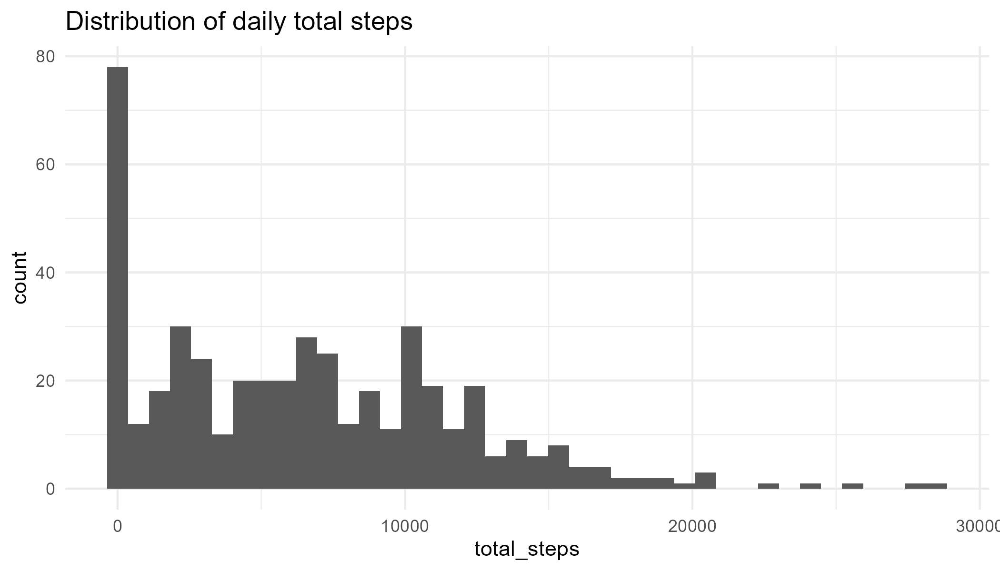

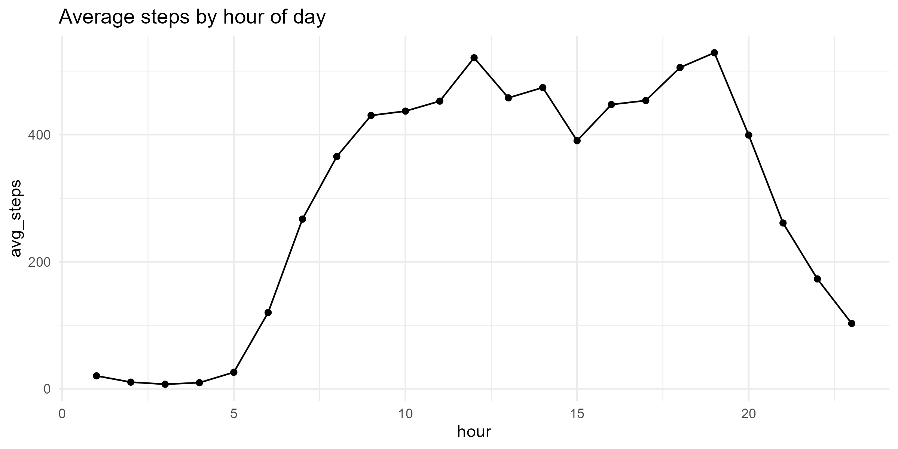

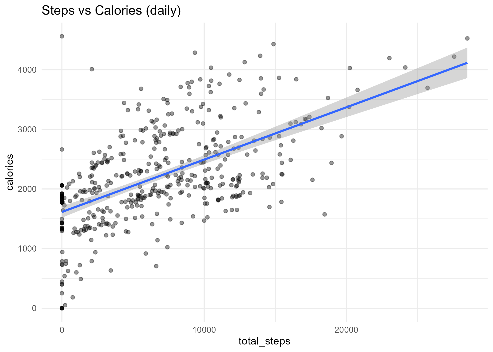

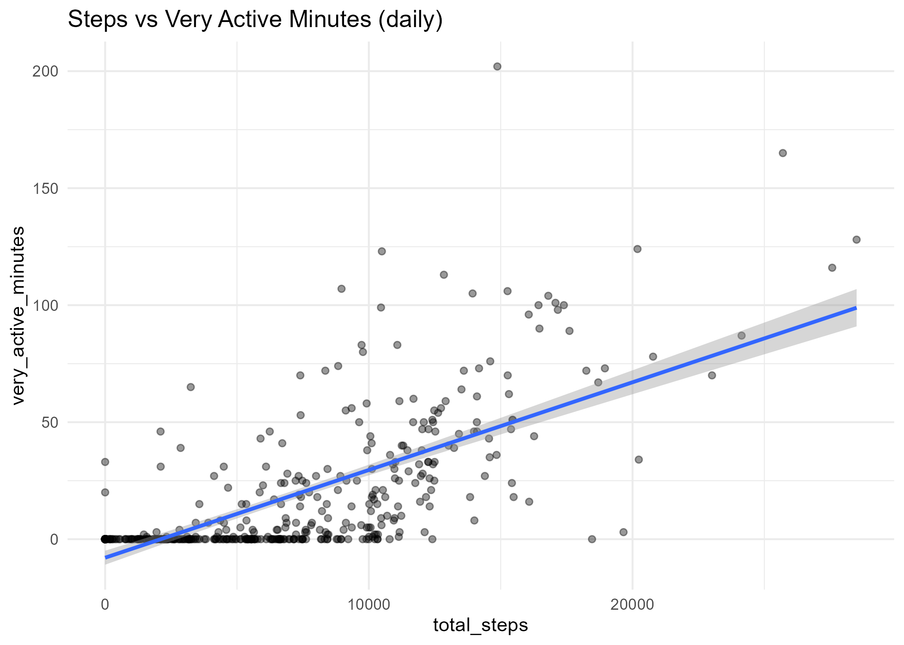

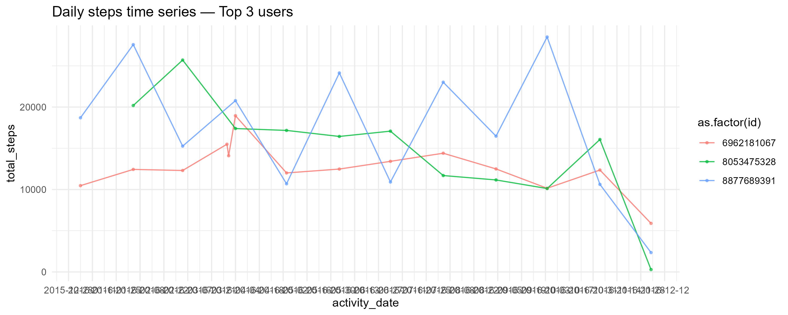

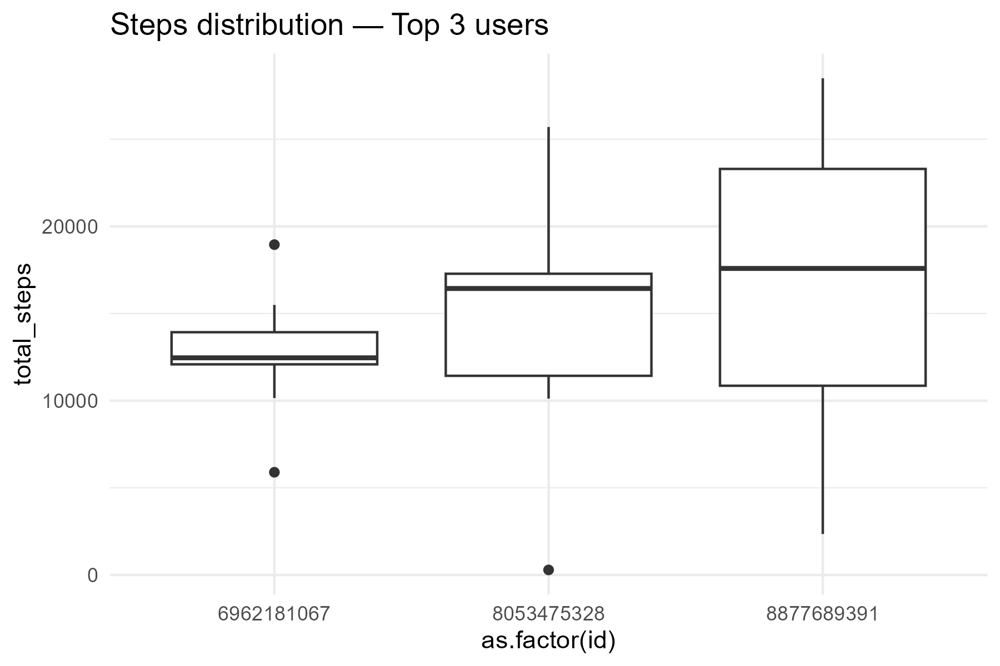

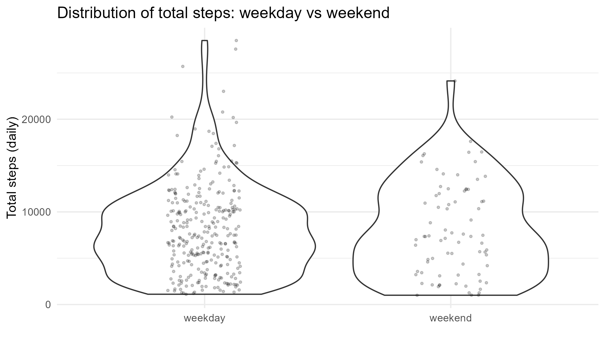

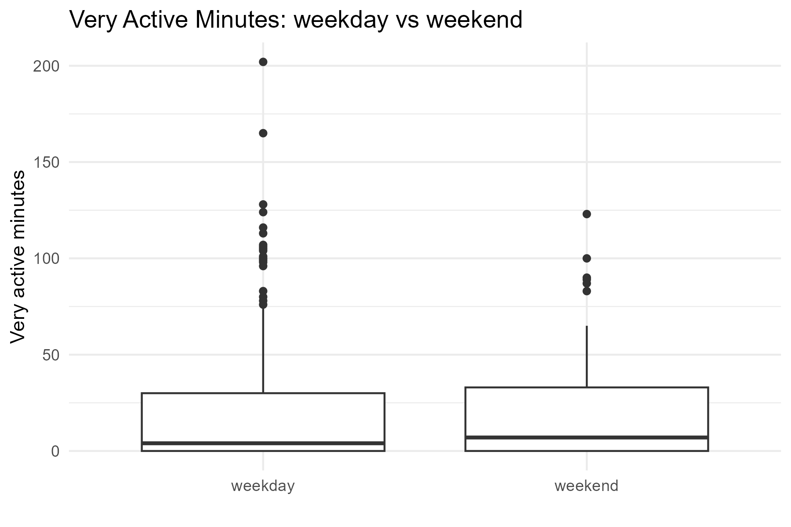

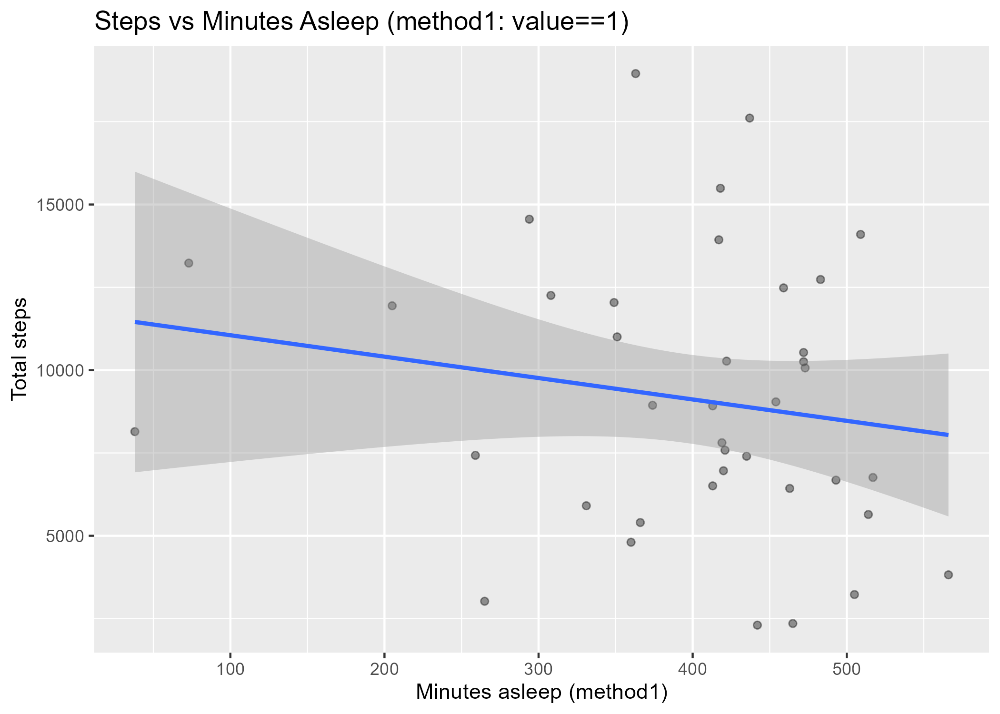

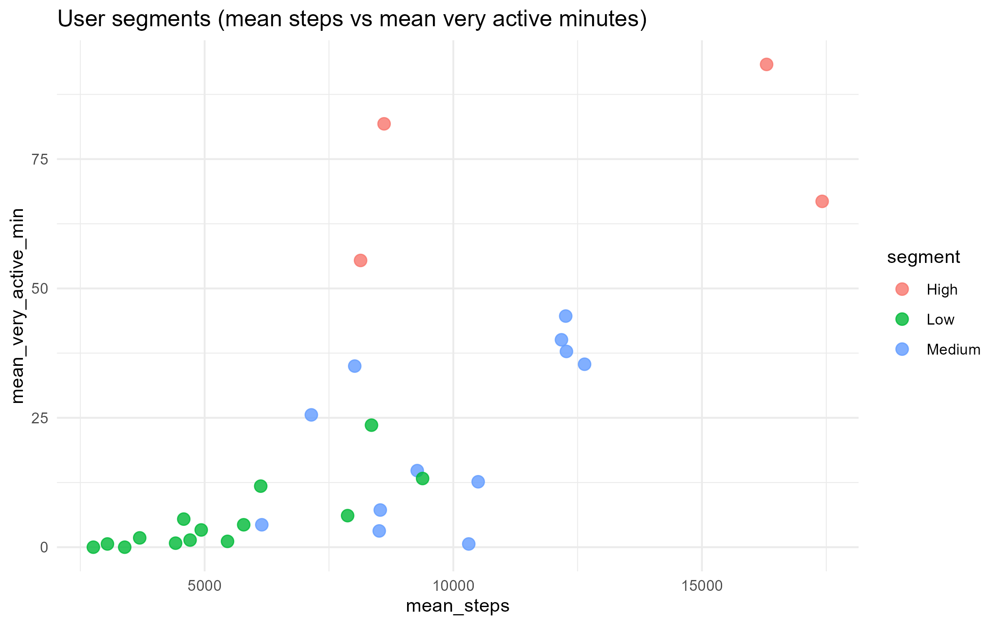

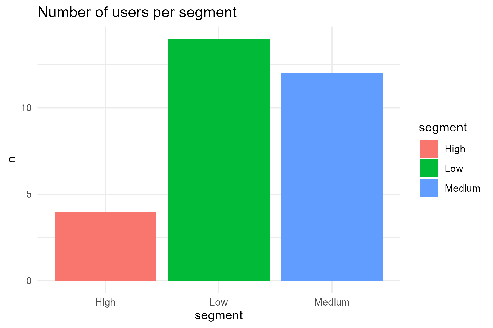

## Recommended run-order (if you want to reproduce)
1. `01_load_inspect.R`
2. `02_prepare_transform_fixed.R`
3. `03_eda_daily.R`
4. `run_now_clean_recalc.R` (filter non-wear)
5. `05_steps_vs_calories.R`
6. `06_segment_users.R`
7. `07_weekday_vs_weekend.R`
8. `hourly_pattern.R`
9. `mixed_effects_weekend.R`
10. `10_sleep_auto_inspect_and_join_fixed.R`
11. `11_final_sleep_and_summary.R`


# Scripts 


## 01_load_inspect.R
**Purpose:** install/load core packages, read Excel sheet names, take safe samples and save a small RDS summary for fast inspection.

**Inputs:** `data/Cleaned_Bellabeat_Data_Final.xlsx` (or same file at project root)

**Outputs:** `prepared/bellabeat_sample_list.rds`

```r
# 01_load_inspect.R (documentation-only)
# Purpose: inspect workbook sheets and save a small sample list
pkgs <- c("tidyverse","readxl","lubridate","janitor","skimr","here")
install.packages(setdiff(pkgs, installed.packages()[,"Package"]), repos="https://cloud.r-project.org")
lapply(pkgs, library, character.only = TRUE)

path <- here::here("data","Cleaned_Bellabeat_Data_Final.xlsx")
if(!file.exists(path)) path <- here::here("Cleaned_Bellabeat_Data_Final.xlsx")

sheets <- readxl::excel_sheets(path)

# read small samples and save summary
sample_list <- lapply(sheets, function(s) {
  df <- readxl::read_excel(path, sheet = s, n_max = 1000) %>% janitor::clean_names()
  list(name = s,
       n_rows_sample = nrow(df),
       n_cols = ncol(df),
       n_missing = sum(is.na(df)),
       glimpse = tibble::as_tibble(df[1:min(5,nrow(df)), ]))
})
names(sample_list) <- sheets
readr::write_rds(sample_list, file = here::here("prepared","bellabeat_sample_list.rds"))
```


## 02_prepare_transform_fixed.R
**Purpose:** read all sheets fully, standardize daily sheet date column, create derived columns (day_of_week, month, active_minutes) and save a prepared RDS.

**Inputs:** Cleaned Excel workbook

**Outputs:** `prepared/bellabeat_prepared_fixed.rds`

```r
# 02_prepare_transform_fixed.R (documentation-only)
library(tidyverse); library(readxl); library(lubridate); library(janitor); library(here)

possible_paths <- c(here::here("data","Cleaned_Bellabeat_Data_Final.xlsx"), here::here("Cleaned_Bellabeat_Data_Final.xlsx"))
path <- possible_paths[file.exists(possible_paths)][1]

# read all sheets
sheets <- readxl::excel_sheets(path)
data_list <- lapply(sheets, function(s) readxl::read_excel(path, sheet = s) %>% janitor::clean_names())
names(data_list) <- sheets

# choose daily sheet heuristically
daily_sheet <- sheets[stringr::str_detect(sheets, regex("daily", ignore_case = TRUE))][1]
daily <- data_list[[daily_sheet]]

# normalize date column
date_col <- names(daily)[stringr::str_detect(names(daily), "date|day|activitydate")][1]
daily[[date_col]] <- parse_date_time(daily[[date_col]], orders = c("ymd","mdy","dmy","Y-m-d H:M:S","m/d/Y","d/m/Y"), tz = "UTC")
if(!"activity_date" %in% names(daily)) names(daily)[names(daily) == date_col] <- "activity_date"

# derived columns
if(all(c("total_steps","calories") %in% names(daily))) {
  daily <- daily %>% mutate(day_of_week = wday(activity_date, label = TRUE, abbr = FALSE),
                             month = month(activity_date, label = TRUE, abbr = FALSE),
                             active_minutes = coalesce(very_active_minutes,0) + coalesce(fairly_active_minutes,0) + coalesce(lightly_active_minutes,0))
}

saveRDS(list(daily = daily, data_list = data_list), file = here::here("prepared","bellabeat_prepared_fixed.rds"))
```


## 03_eda_daily.R
**Purpose:** compute per-user summaries, save `user_summary_daily.csv`, and produce basic plots.

**Inputs:** prepared daily RDS

**Outputs:** `outputs/user_summary_daily.csv`, `plots/hist_total_steps.png`, `plots/avg_steps_by_weekday.png`

```r
# 03_eda_daily.R (documentation-only)
if(!exists("daily")) {
  tmp <- readRDS(here::here("prepared","bellabeat_prepared_fixed.rds")); daily <- tmp$daily; rm(tmp)
}

user_summary <- daily %>% group_by(id) %>% summarize(days_recorded = n(), mean_steps = mean(total_steps, na.rm = TRUE), median_steps = median(total_steps, na.rm = TRUE), mean_calories = mean(calories, na.rm = TRUE), mean_very_active_min = mean(very_active_minutes, na.rm = TRUE))
readr::write_csv(user_summary, here::here("outputs","user_summary_daily.csv"))

p_hist <- ggplot(daily, aes(x = total_steps)) + geom_histogram(bins = 40) + labs(title = "Distribution of daily total steps") + theme_minimal()
ggsave(here::here("plots","hist_total_steps.png"), p_hist, width = 7, height = 4)

if("activity_date" %in% names(daily)) {
  p_weekday <- daily %>% mutate(day_of_week = wday(activity_date, label = TRUE, abbr = FALSE)) %>% group_by(day_of_week) %>% summarize(avg_steps = mean(total_steps, na.rm=TRUE)) %>% ggplot(aes(x = day_of_week, y = avg_steps)) + geom_col() + labs(title = "Average steps by day of week") + theme_minimal()
  ggsave(here::here("plots","avg_steps_by_weekday.png"), p_weekday, width = 7, height = 4)
}
```


## 04_top3_timeseries.R
**Purpose:** Identify top-3 active users and plot time series & boxplots for them.

**Inputs:** daily / outputs/user_summary_daily.csv

**Outputs:** `plots/top3_users_timeseries.png`, `plots/top3_users_boxplot.png`

```r
# 04_top3_timeseries.R (documentation-only)
if(!exists("daily")) { tmp <- readRDS(here::here("prepared","bellabeat_prepared_fixed.rds")); daily <- tmp$daily; rm(tmp) }
user_summary <- daily %>% group_by(id) %>% summarize(mean_steps = mean(total_steps, na.rm = TRUE), days_recorded = n()) %>% arrange(desc(mean_steps))
top3 <- user_summary %>% slice_max(mean_steps, n = 3)
daily_top3 <- daily %>% filter(id %in% top3$id) %>% arrange(id, activity_date)

p_ts <- ggplot(daily_top3, aes(x = activity_date, y = total_steps, color = as.factor(id))) + geom_line(alpha = 0.8) + geom_point(size = 0.8, alpha = 0.6) + labs(title = "Daily steps time series — Top 3 users") + theme_minimal()
ggsave(here::here("plots","top3_users_timeseries.png"), p_ts, width = 10, height = 4)

p_box <- ggplot(daily_top3, aes(x = as.factor(id), y = total_steps)) + geom_boxplot() + labs(title = "Steps distribution — Top 3 users") + theme_minimal()
ggsave(here::here("plots","top3_users_boxplot.png"), p_box, width = 6, height = 4)
```


## 05_steps_vs_calories.R
**Purpose:** compute correlations between steps & calories and steps & very_active_minutes; save results and scatterplots.

**Inputs:** daily records

**Outputs:** `outputs/correlations_steps_metrics.csv`, `plots/steps_vs_calories_filtered.png`, `plots/steps_vs_active_minutes_filtered.png`

```r
# 05_steps_vs_calories.R (documentation-only)
if(!exists("daily")) { tmp <- readRDS(here::here("prepared","bellabeat_prepared_fixed.rds")); daily <- tmp$daily; rm(tmp) }

daily_clean <- daily %>% filter(!is.na(total_steps) & !is.na(calories) & !is.na(very_active_minutes))
cor_steps_cal <- cor.test(daily_clean$total_steps, daily_clean$calories, method = "pearson")
cor_steps_active <- cor.test(daily_clean$total_steps, daily_clean$very_active_minutes, method = "pearson")

res_df <- tibble(metric = c("steps_vs_calories","steps_vs_very_active_minutes"), estimate = c(cor_steps_cal$estimate, cor_steps_active$estimate), p_value = c(cor_steps_cal$p.value, cor_steps_active$p.value))
readr::write_csv(res_df, here::here("outputs","correlations_steps_metrics.csv"))

p1 <- ggplot(daily_clean, aes(x = total_steps, y = calories)) + geom_point(alpha = 0.4) + geom_smooth(method = "lm", se = TRUE) + labs(title = "Steps vs Calories (daily)") + theme_minimal()
ggsave(here::here("plots","steps_vs_calories_filtered.png"), p1, width = 7, height = 5)

p2 <- ggplot(daily_clean, aes(x = total_steps, y = very_active_minutes)) + geom_point(alpha = 0.4) + geom_smooth(method = "lm", se = TRUE) + labs(title = "Steps vs Very Active Minutes (daily)") + theme_minimal()
ggsave(here::here("plots","steps_vs_active_minutes_filtered.png"), p2, width = 7, height = 5)
```


## run_now_clean_recalc.R
**Purpose:** filter out probable non-wear days (threshold: total_steps >= 1000), recalc correlations and re-save filtered CSV and plots.

**Inputs:** daily

**Outputs:** `outputs/daily_filtered_steps1000.csv` and filtered plots

```r
# run_now_clean_recalc.R (documentation-only)
if(!exists("daily")) { tmp <- readRDS(here::here("prepared","bellabeat_prepared_fixed.rds")); daily <- tmp$daily; rm(tmp) }

daily_filtered <- daily %>% filter(!is.na(total_steps) & total_steps >= 1000)
readr::write_csv(daily_filtered, here::here("outputs","daily_filtered_steps1000.csv"))

p3 <- ggplot(daily_filtered, aes(x = total_steps, y = calories)) + geom_point(alpha = 0.4) + geom_smooth(method="lm", se=TRUE) + labs(title = "Steps vs Calories (filtered)") + theme_minimal()
ggsave(here::here("plots","steps_vs_calories_filtered_v2.png"), p3, width = 7, height = 5)
```


## 06_segment_users.R
**Purpose:** aggregate users, perform k-means (k=3) segmentation into Low/Medium/High and save outputs & plots.

**Inputs:** `outputs/daily_filtered_steps1000.csv`

**Outputs:** `outputs/user_segments_k3.csv`, `outputs/segment_summary_k3.csv`, `plots/segments_scatter_meansteps_vs_active.png`, `plots/segments_counts.png`

```r
# 06_segment_users.R (documentation-only)
if(!file.exists(here::here("outputs","daily_filtered_steps1000.csv"))) stop("Run filtering first")
user_seg <- readr::read_csv(here::here("outputs","daily_filtered_steps1000.csv"), show_col_types = FALSE) %>% group_by(id) %>% summarize(days_recorded = n(), mean_steps = mean(total_steps, na.rm=TRUE), mean_calories = mean(calories, na.rm=TRUE), mean_very_active_min = mean(very_active_minutes, na.rm=TRUE), .groups = "drop") %>% filter(days_recorded >= 7)
set.seed(123)
seg_data <- user_seg %>% select(mean_steps, mean_calories, mean_very_active_min) %>% scale()
k3 <- kmeans(seg_data, centers = 3, nstart = 25)
user_seg$cluster <- as.factor(k3$cluster)
cluster_order <- user_seg %>% group_by(cluster) %>% summarize(avg_steps = mean(mean_steps)) %>% arrange(avg_steps) %>% pull(cluster)
labels <- c("Low","Medium","High")
label_map <- setNames(labels, cluster_order)
user_seg <- user_seg %>% mutate(segment = label_map[as.character(cluster)])
readr::write_csv(user_seg, here::here("outputs","user_segments_k3.csv"))
seg_summary <- user_seg %>% group_by(segment) %>% summarize(users = n(), avg_days_recorded = mean(days_recorded), avg_mean_steps = round(mean(mean_steps),1), avg_calories = round(mean(mean_calories),1), avg_very_active_min = round(mean(mean_very_active_min),1))
readr::write_csv(seg_summary, here::here("outputs","segment_summary_k3.csv"))

p_seg <- ggplot(user_seg, aes(x = mean_steps, y = mean_very_active_min, color = segment)) + geom_point(size=3, alpha=0.8) + labs(title = "User segments (mean steps vs mean very active minutes)") + theme_minimal()
ggsave(here::here("plots","segments_scatter_meansteps_vs_active.png"), p_seg, width=8, height=5)

p_bar <- user_seg %>% count(segment) %>% ggplot(aes(x = segment, y = n, fill = segment)) + geom_col() + labs(title = "Number of users per segment") + theme_minimal()
ggsave(here::here("plots","segments_counts.png"), p_bar, width=6, height=4)
```


## 07_weekday_vs_weekend.R
**Purpose:** compare weekday vs weekend activity and active minutes; print summaries, t-test, and save plot.

**Inputs:** `outputs/daily_filtered_steps1000.csv`

**Outputs:** `outputs/summary_weekday_vs_weekend.csv`, `plots/avg_steps_weekday_vs_weekend.png`

```r
# 07_weekday_vs_weekend.R (documentation-only)
if(!file.exists(here::here("outputs","daily_filtered_steps1000.csv"))) stop("Run filtering first")
df <- readr::read_csv(here::here("outputs","daily_filtered_steps1000.csv"), show_col_types = FALSE) %>% mutate(activity_date = as_date(as_datetime(activity_date)))
df <- df %>% mutate(day = wday(activity_date, label = TRUE, abbr = FALSE), is_weekend = if_else(day %in% c("Saturday","Sunday"), "weekend", "weekday"))
summary_by_week <- df %>% group_by(is_weekend) %>% summarize(n = n(), mean_steps = mean(total_steps, na.rm=TRUE), median_steps = median(total_steps, na.rm=TRUE), mean_very_active_min = mean(very_active_minutes, na.rm=TRUE))
readr::write_csv(summary_by_week, here::here("outputs","summary_weekday_vs_weekend.csv"))

p <- df %>% group_by(is_weekend, day) %>% summarize(avg_steps = mean(total_steps, na.rm=TRUE)) %>% ggplot(aes(x = day, y = avg_steps, fill = is_weekend)) + geom_col(position = "dodge") + labs(title = "Average steps: weekday vs weekend") + theme_minimal()
ggsave(here::here("plots","avg_steps_weekday_vs_weekend.png"), p, width=9, height=4)
```


## hourly_pattern.R
**Purpose:** analyze `+Hourly_Activity_Data` sheet (if present) to compute average steps by hour-of-day and save outputs.

**Inputs:** `+Hourly_Activity_Data` sheet in the Excel file

**Outputs:** `outputs/hourly_steps_summary.csv`, `plots/avg_steps_by_hour.png`

```r
# hourly_pattern.R (documentation-only)
path <- here::here("data","Cleaned_Bellabeat_Data_Final.xlsx")
if(!file.exists(path)) path <- here::here("Cleaned_Bellabeat_Data_Final.xlsx")
if("+Hourly_Activity_Data" %in% readxl::excel_sheets(path)) {
  hr <- readxl::read_excel(path, sheet = "+Hourly_Activity_Data") %>% janitor::clean_names()
  time_col <- names(hr)[stringr::str_detect(names(hr), "hour|time|activityhour|activity_hour")][1]
  steps_col <- names(hr)[stringr::str_detect(names(hr), "step|steps|total_steps")][1]
  hr <- hr %>% mutate(activity_hour = parse_date_time(!!sym(time_col), orders = c("Y-m-d H:M:S","ymd HMS","ymd HM"), tz = "UTC")) %>% mutate(hour = hour(activity_hour))
  summary_hr <- hr %>% group_by(hour) %>% summarize(avg_steps = mean(!!sym(steps_col), na.rm=TRUE), n = n(), .groups = "drop")
  readr::write_csv(summary_hr, here::here("outputs","hourly_steps_summary.csv"))
  p_hr <- ggplot(summary_hr, aes(x = hour, y = avg_steps)) + geom_line() + geom_point() + labs(title = "Average steps by hour of day") + theme_minimal()
  ggsave(here::here("plots","avg_steps_by_hour.png"), p_hr, width=8, height=4)
} else {
  message("No +Hourly_Activity_Data sheet found.")
}
```


## mixed_effects_weekend.R
**Purpose:** fit a simple mixed-effects model: `total_steps ~ is_weekend + (1 | id)` to test weekend effect while controlling for per-user variation.

**Inputs:** `outputs/daily_filtered_steps1000_with_weekend.csv`

**Outputs:** `outputs/mixed_effects_weekend_summary.txt`

```r
# mixed_effects_weekend.R (documentation-only)
library(lme4); library(lmerTest); library(tidyverse); library(here)

if(!file.exists(here::here("outputs","daily_filtered_steps1000_with_weekend.csv"))) stop("Run weekday/weekend step first")
daily_m <- readr::read_csv(here::here("outputs","daily_filtered_steps1000_with_weekend.csv"), show_col_types = FALSE) %>% mutate(activity_date = as_datetime(activity_date), is_weekend = factor(is_weekend, levels = c("weekday","weekend")), id = as.factor(id))

m1 <- lmer(total_steps ~ is_weekend + (1 | id), data = daily_m, REML = FALSE)
capture.output(summary(m1), file = here::here("outputs","mixed_effects_weekend_summary.txt"))
```


## 10_sleep_auto_inspect_and_join_fixed.R
**Purpose:** smartly aggregate minute-level sleep sheet (`+minuteSleep_merged`) into daily minutes asleep using heuristics, join with daily activity, compute correlations and save outputs (non-executed block here for documentation).

**Inputs:** `data/Cleaned_Bellabeat_Data_Final.xlsx`, `outputs/daily_filtered_steps1000_with_weekend.csv`

**Outputs:** `outputs/sleep_daily_method1.csv`, `outputs/sleep_daily_sumvalue.csv`, `outputs/activity_sleep_joined.csv`, `plots/steps_vs_sleep_method1.png`, `outputs/mixed_effects_sleep_summary.txt`

**Sleep aggregation note:**
The minute-level column `value` in `+minuteSleep_merged` has values {1,2,3}. We used two approaches:
- `method1`: count minutes where `value == 1` (assumed "minutes asleep").
- `method_sum`: sum all `value` entries (alternative heuristic).
Method1 was chosen for modeling but both results are saved: `outputs/sleep_daily_method1.csv` and `outputs/sleep_daily_sumvalue.csv`. Interpret sleep results cautiously (small matched sample and ambiguous minute codes).


```r
# 10_sleep_auto_inspect_and_join_fixed.R (documentation-only)
library(tidyverse); library(lubridate); library(readxl); library(janitor); library(here)

xlsx_path <- here::here("data","Cleaned_Bellabeat_Data_Final.xlsx")
if(!file.exists(xlsx_path)) xlsx_path <- here::here("Cleaned_Bellabeat_Data_Final.xlsx")
stopifnot(file.exists(xlsx_path))

filtered_path <- here::here("outputs","daily_filtered_steps1000_with_weekend.csv")
if(!file.exists(filtered_path)) stop("Missing filtered daily file — run the filtering step first")

daily <- readr::read_csv(filtered_path, show_col_types = FALSE) %>% mutate(activity_date = as_date(as_datetime(activity_date)))

# choose sleep sheet heuristically and aggregate minute-level flags
sheets <- readxl::excel_sheets(xlsx_path)
sleep_sheet <- sheets[str_detect(sheets, regex("sleep|sleepday|sleep_day", ignore_case = TRUE))][1]
message("Using sleep sheet: ", sleep_sheet)
sleep_raw <- readxl::read_excel(xlsx_path, sheet = sleep_sheet) %>% janitor::clean_names()

# Strategy: if 'value' exists and appears as minute-level flags, aggregate accordingly
# method1: count value == 1 as 'asleep' minutes; method_sum: sum(value)
if("value" %in% names(sleep_raw) && is.numeric(sleep_raw$value)) {
  sleep_daily_method1 <- sleep_raw %>% mutate(id = as.numeric(as.character(id)), sleep_date = as_date(as_datetime(date))) %>% group_by(id, sleep_date) %>% summarize(total_minutes_asleep_method1 = sum(value == 1, na.rm = TRUE), .groups = "drop")
  sleep_daily_sum <- sleep_raw %>% mutate(id = as.numeric(as.character(id)), sleep_date = as_date(as_datetime(date))) %>% group_by(id, sleep_date) %>% summarize(total_minutes_asleep_sum = sum(as.numeric(value), na.rm = TRUE), .groups = "drop")
}

# Join and correlation
joined <- daily %>% inner_join(sleep_daily_method1 %>% rename(activity_date = sleep_date), by = c("id","activity_date"))

# correlation test and save
ct <- cor.test(joined$total_steps, joined$total_minutes_asleep_method1, method = "pearson")
readr::write_csv(joined, here::here("outputs","activity_sleep_joined.csv"))

p <- ggplot(joined, aes(x = total_minutes_asleep_method1, y = total_steps)) + geom_point(alpha = 0.4) + geom_smooth(method = "lm", se = TRUE) + labs(title = "Steps vs Minutes Asleep (method1)") + theme_minimal()
ggsave(here::here("plots","steps_vs_sleep_method1.png"), p, width = 7, height = 5)

# optionally build mixed-effects model if enough rows
if(nrow(joined) > 5) {
  library(lme4); library(lmerTest)
  joined <- joined %>% mutate(id = as.factor(id))
  m_sleep <- lmer(total_minutes_asleep_method1 ~ total_steps + very_active_minutes + (1 | id), data = joined, REML = FALSE)
  capture.output(summary(m_sleep), file = here::here("outputs","mixed_effects_sleep_summary.txt"))
}
```


## 11_final_sleep_and_summary.R
**Purpose:** robust single-file script we used to finalize sleep vs activity analysis (automated heuristics, mixed model, saved recommendations). Documented here for completeness.

```r
# 11_final_sleep_and_summary.R (documentation-only)
# See previous script for details — this script is a slightly more robust, combined version that saves sleep_daily_method1.csv, sleep_daily_sumvalue.csv, activity_sleep_joined.csv and mixed-effects summary.
# The full code used interactively is the same as the combined logic in 10_sleep_auto_inspect_and_join_fixed.R plus additional saving of recommendations.txt.
```


## Short recommendations

**Summary:** Prioritize `very_active_minutes` and segmented campaigns (Low/Med/High); improve sleep data collection to enable robust sleep–activity analysis.

- Use **very_active_minutes** as the primary exertion KPI for marketing and product messaging.  
- Implement user segmentation (Low / Medium / High) and deliver tailored campaigns per segment.  
- Request a clear `total_minutes_asleep` export in future datasets to avoid heuristic aggregation.  
- Schedule push notifications by hour (late morning, early evening) rather than relying on weekend vs weekday differences.  
- Before claiming "steps improve sleep", collect larger matched sleep samples and run paired / mixed-effects analyses.

---

